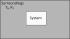

# Thermodynamic Potentials
Up until this point, we have been working a lot with the internal energy if a system, $U$, which is a function of state.

In principle, we can combine $U$ with any other functions of state ($P$, $V$, $S$, $T$) to create new functions of state. This are called **thermodynamic potentials**. Many of these combinations are not particularly useful, but there are 3 that are, and in this next section, we are going to look at these 3.

## Internal Energy
In lecture 6, we used internal energy and the F.T.R. to come up with some useful identities for temperature and pressure. To recap
$$
    {\rm d} U = T{\rm d} S - P {\rm d} V
$$
Now, using one of the tricks we used earlier, given that U is now only a function of S and V, we can write U as
$$
    {\rm d} U = \left( \frac{\partial U}{\partial S}\right)_V {\rm d} S + \left( \frac{\partial U}{\partial V}\right)_S {\rm d} V
$$
let's us identify pressure and temperature as
$$
\begin{align}
    T &= \left( \frac{\partial U}{\partial S}\right)_V\\
    P &= -\left( \frac{\partial U}{\partial V}\right)_S\\
\end{align}
$$
 Now we will define an isochoric process as one during which the volume stays constant (${\rm d} V = 0$). In this case, we have
$$
    {\rm d}U = T{\rm d}S
$$
If we have a reversible isochoric process, then we also have that
$$
    {\rm d}U = {\rm d}Q = C_V {\rm d} T
$$
Thus, the change in internal energy during a reversible, isochoric process is trivial to work out, and is
$$
\Delta U = \int_{T_1}^{T_2} C_{\rm V}\:{\rm d} T
$$
What we want to do now is determine similar useful expressions, but for processes that are not isochoric.
## Enthalpy
Imagine we are studying a small thermodynamic system inside a large room. Keeping track of the total internal energy of the system as it does work (or has work done on it) can be a bit of a pain. Instead, we can always add the work that is needed to make space for the system. This gives us enthalpy:
$$
    H = U+PV.
$$
To understand what this potential represents, I will rely on Daniel Schroeder's analogy. Consider making a rabbit of volume $V$ appear in a room. Not only must the internal energy of the rabbit $U$ be provided, but but also additional energy is required to move the atmosphere which is occupying the space that you want the rabbit to exist in out of the way. This energy is equal to the work done $PV$. So the enthalpy represents the total energy required to bring something into existence (or, alternatively, represents the total energy you could extract if you made something completely dissappear, including the work done by the atmosphere as it moves back in to replace the rabbit that has vanished).

Thus, an infinitesimal change in $H$ is given by
$$
\begin{align}
    {\rm d} H &= T{\rm d} S - P {\rm d} V + P {\rm d} V + V {\rm d} P\\
    {\rm d} H &= T{\rm d} S + V {\rm d} P
\end{align}
$$
From this, we can say that $H=H(S,P)$. For an isobaric process (${\rm d}P=0$), we then have
$$
    {\rm d} H = T{\rm d} S
$$
and for a reversible, isobaris process we have
$$
    {\rm d}H = {\rm d}Q = C_P {\rm d} T
$$
Thus
$$
    \Delta H = \int_{T_1} ^{T_2} C_P {\rm d} T
$$
Thus, for a process performed at contant pressure, then the enthalpy represents the heat (which is why it's called H) transferred to or from the system.
Our definition of the enthalpy also gives us that
$$
   T = \left(\frac{\partial H}{\partial S}\right)_P ; V = \left(\frac{\partial H}{\partial P}\right)_S
$$
## Helmholtz Free Energy (or Helmholtz Function)
The above potentials are both functions of entropy, $S$, which can difficult to vary experimentally. This next thermodynamic potential does not suffer the same drawback. Let's define the Helmholtz Free Energy as
$$
    F = U - TS.
$$
Again, think about our rabbit. In this case, we can realise that the environment that we are making the rabbit appear in is able to provide some of the internal energy the rabbit gets via heat transfer. Hence, $F$ represents all of the work that is required to bring the rabbit into the room, minus the energy we get for free from the environment.
This gives
$$
\begin{align}
    {\rm d} F &= T {\rm d} S - P {\rm d} V - T {\rm d} S - S {\rm d} T\\
              &= - S {\rm d} T - P {\rm d} V
\end{align}
$$
From this, we can say that $F=F(T,V)$. For an isothermal process, we thus have
$$
    {\rm d} F = - P {\rm d} V
$$
giving
$$
    \Delta F = - \int_{V_1}^{V_2} P {\rm d} V
$$
Our definition of the Helmholtz Free Energy also gives us that
$$
   S = -\left(\frac{\partial F}{\partial T}\right)_V ; P = -\left(\frac{\partial F}{\partial V}\right)_T
$$
## Gibbs Free Energy (or Gibbs Function)
Let
$$
    G = H - TS
$$
This is now represents a combination of the above ideas. As we create the rabbit in the room, the total energy that must be supplied is the enthalpy - but the total energy we'll have to provide is this minus whatever energy we get for free via heat transfer from the environment.

In differential form this gives
$$
\begin{align}
    {\rm d} G &= T {\rm d} S + V {\rm d} P - T {\rm d} S - S {\rm d} T\\
              &= - S {\rm d} T + V {\rm d} P
\end{align}
$$
Thus $G=G(T,P)$, which is particularly useful as both $T$ and $P$ are easy to control and change in experiments. Thus, if you have an isothermal isobaric process, then ${\rm d} G = 0$. This will be useful when we are studying phase transitions later.
Our definition of the Gibbs Free Energy also gives us that
$$
   S = -\left(\frac{\partial G}{\partial T}\right)_P ; V = \left(\frac{\partial G}{\partial P}\right)_T
$$
## Availability
So what use are these new thermodynamic potentials? For isolated systems, the entropy tends to increase, as we've seen previously. But often our systems are not isolated, but are embedded inside some surroundings - so let's look at this. The system will be allowed to exchange heat and to do work on the surroundings.

We're going to assume that the surrondings act like a reservoir, and that the temperature of the and volume of surroundings stays constant. The change in entropy of the Universe due to some change in our system and surroundings are
$$
{\rm d}S_{\rm Total}={\rm d}S+{\rm d}S_{\rm 0}
$$
where the subscript 0 refers to our surroundings.

We can write the F.T.E. as
$$
{\rm d}S = \frac{1}{T}{\rm d}U+\frac{P}{T}{\rm d}V
$$
meaning the entropy change of the surroundings for fixed temperature and volume is
$$
{\rm d}S_0 = \frac{1}{T_0}{\rm d}U_0
$$
giving
$$
{\rm d}S_{\rm Total} = {\rm d}S+ \frac{1}{T_0}{\rm d}U_0
$$
Since the temperature of the system is at the same temperature as our surroundings ($T_0=T$), and through conservation of energy we require ${\rm d}U=-{\rm d}U_0$, we get
$$
{\rm d}S_{\rm Total} = {\rm d}S-\frac{1}{T}{\rm d}U
$$
or, alternatively,
$$
{\rm d}S_{\rm Total} = -\frac{1}{T}({\rm d}U-T{\rm d}S)=-\frac{1}{T}{\rm d F}
$$
So, given that the total entropy must be increasing (The second law tells us that ${\rm d} S_{\rm Total} \geq 0$), this final line tells us that  the Helmholtz Free Energy of the system must be decreasing (${\rm d} F \leq 0$) 

We could also consider a process during which the volume of the system can change, but the pressure of the system stays the same as that as the reservoir. In this case, we'd get 

$$
{\rm d}S_{\rm Total} = {\rm d}S-\frac{1}{T}{\rm d}U-\frac{P}{T}{\rm d}V
$$
assuming that $T_0=T$, ${\rm d}U=-{\rm d}U_0$, and ${\rm d}V=-{\rm d}V_0$. Tidying this up gives
$$
{\rm d}S_{\rm Total} =-\frac{1}{T}{\rm d G}
$$
So, given that the total entropy must be increasing (The second law tells us that ), this final line tells us that  the Gibbs Energy of the system must be decreasing (${\rm d} G \leq 0$) .